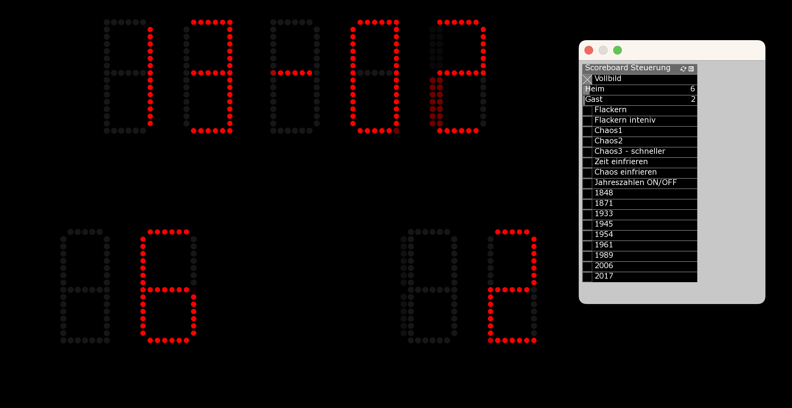

# Custom Scoreboard WLB Esslingen

Legacy project developed in 2017.

Custom scoreboard application for a theatre production of Württembergische Landesbühne Esslingen in 2017. OpenFrameworks project (originally Windows/Visual Studio, ported to macOS using CursorAgent (2025)).

## Requirements

- **openFrameworks 0.9.8** for macOS: [of_v0.9.8_osx_release](https://openframeworks.cc/versions/v0.9.8/of_v0.9.8_osx_release.zip)
- Addons: ofxParamEdit, ofxPointilize, ofxSegmentDisplay

## Setup (macOS)

1. Download and extract OF 0.9.8 for macOS.
2. Place the extracted folder (`of_v0.9.8_osx_release`) next to this repo and rename to `openFrameworks`
3. Place addons in openFrameworks addon folder
4. Build: **Make:** `make` (from project root) & `run make`

## Original (Windows)

Built with Visual Studio 2015, OF 0.9.8 vs release. See `Scoreboard.vcxproj` for reference.
